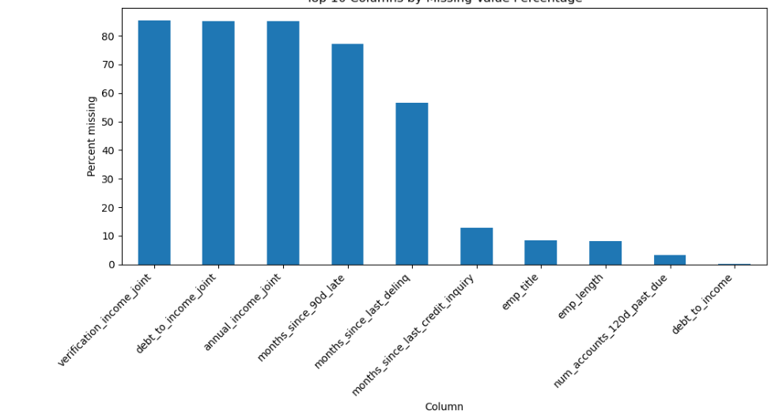
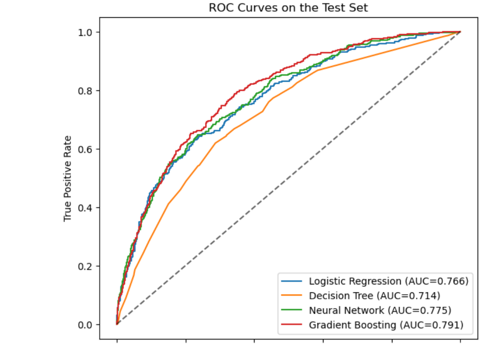
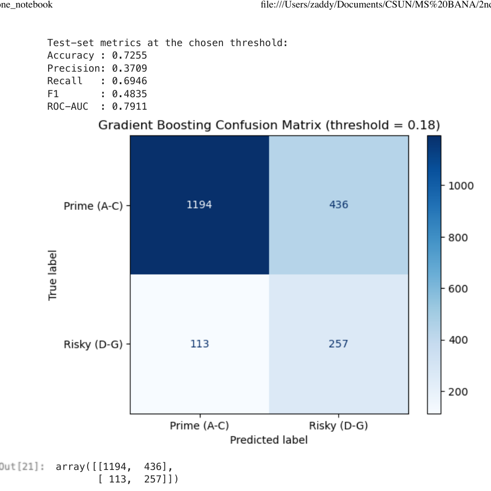
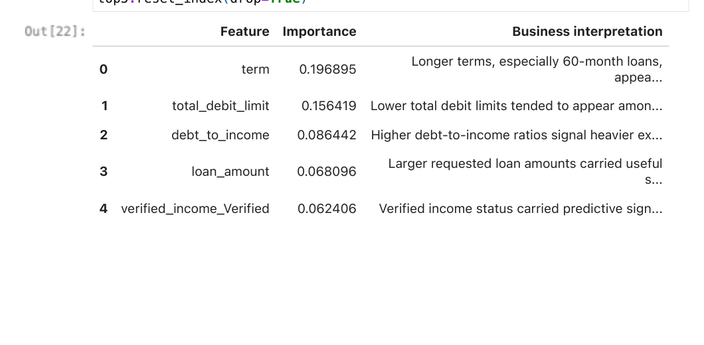

# LendingClub — Credit Risk Modeling 

Capstone project predicting borrower risk (Prime A–C vs Risky D–G) using multiple predictive techniques and evaluating performance with ROC-AUC, threshold selection, and business interpretation.

## Quick Links
- Business memo: `report/report_memo.pdf`
- Concept reflection: `report/report_reflection.pdf`
- Notebook (PDF): `report/report_notebook.pdf`
- Notebook (HTML): `report/report_notebook.html` (download to view)

## Highlights
- Compared Logistic Regression, Decision Tree, Neural Network, and Gradient Boosting on a held-out test set.
- Selected an operating threshold by maximizing validation F1 (instead of default 0.50).
- Recommended Gradient Boosting for production based on ROC-AUC and ranking performance.

## Key Results (Gradient Boosting @ threshold = 0.18)
- Accuracy: 0.7255  
- Precision: 0.3709  
- Recall: 0.6946  
- F1: 0.4835  
- ROC-AUC: 0.7911  

## Visuals

### Missingness (Top 10 Columns)

### ROC Curves (Test Set)

### Confusion Matrix (Chosen Threshold)

### Top 5 Drivers (Gradient Boosting)

## Data Availability
Raw dataset is excluded from this repository. Place `lending_club_raw.csv` in a local `data/` folder to reproduce results.
